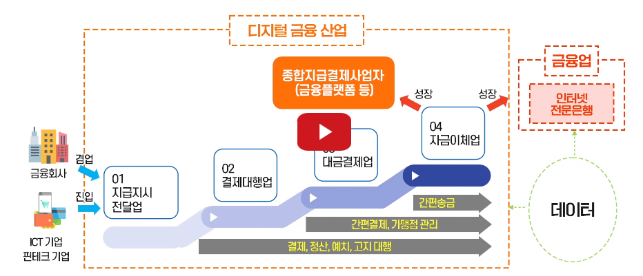

# 디지털전환 & 4차산업혁명

## 1. 인터넷은 라떼, 이제는 디지털 전환

#### 1-1. 디지털 전환

* 기후변화의 영향 범위와 같다.

  * 인간의 삶에 광범위한 영향을 끼지는 디지털전환
  * 디지털 기술의 범용성 때문이다.
  * 3D 프린팅, 유전자 가위 등은 특정분야에 사용
  * 다양항 기술과 융합해 범용적으로 영향을 끼치는 디지털 기술

* 테슬라 적자인데 무엇으로 돈을 버나?

  * 탄소배출권(허용량보다 남아서 다른기업에 판다)
  * 비트코인

  * 파생적인 디지털 수단
    * 즉, 광고 등으로 돈을 버는 디지털 기업

* 디지털뉴딜이란

  * 디지털과 그린
  * 기계화, 전기화, 정보화, 그리고 디지털전환

* 지능과 공간의 확장

  * 지능 : 인공지능 사물지능
  * 공간 : 정보화/인터넷 사물인터

* 기존 기술을 파괴 또는 대체 - 존속적 혁신 - 파괴적 혁신

* 온라인의 가속화

* 디지털 전환의 속도에 몸을 맡겨라

#### Quiz

1. 제 1차 산업혁명은 기계화, 2차는 전기화, 3차는 정보화 혁명입니다. 4차는 무엇일까요?
   * 디지털전환 (지능정보기술의 융합)

2. 디지털 전환의 속도가 가속될 것이라고 여기는 이유는 기술발전은 선형적 증가가 아니라 
   * **지수적 증가** 이기 때문이다.

## 2. 디지털 전환으로 뜨는 콘텐츠

* 게임과 현실의 사이

  * VR : 버추어 
  * AR : 실제세상에 가상화
  * XR : VR + AR
  * 메타버스 : 유니버스(현실) + 가공, 추상

* BEGINS

  * Beyond Game, Toward Economy 게임을 넘어 경제로
  * Expanding Metaverse Device 확대되는 메타버스기기
  * Growing Digital Human 디지털 휴먼의 확장
  * Ip * Metaverse 다양한 IP와 협력하는 메타버스
  * NFT * Metaverse NFT와 결합하는 메타버스

  * Surprising Future 놀라운 미래를 준비하라

* 경제

* 메타버스

* 디지털휴먼

* 이야기, 웹툰 웹소설 

* 문학작품

#### Quize

* 메타버스와 가상화

## 3. 디지털 전환으로 뜨는 기업들

* 사물인터넷 - 데이터 연결 - 클라우딩 - 빅데이터 - 딥러닝 - 최적화 - O2O - 데이터 - 사물인터넷
* Value Constellation - 가치 은하계
* 디지털 금융산업
  * 지급지시 전달업
  * 결제대행업
  * 대금결제업
  * 자금이체업
  * 종합지급결제사업자
  * 인터넷전문은행
  * 

* 부동산
  * 직방의 신뢰성 평가
* 의료
* 농업
* 어업
* 구독경제
  * 교통수단 구독
  * 타이어 구독
  * 전기차 배터리 구독
* 디지털 전환의 핵심은 연결과 관계 유지
* 데이터 수집 및 결합, 분석과 마케팅 (관계유지)

#### Quiz 구독형 비즈니스 모델

* MaaS 교통
* TaaS 타이어
* BaaS 배터리
* LaaS 조명

## 4. 디지털 전환과 일자리

기계에게 일을 시키든지, 기계와 함께 일을 하든지.

* 디지털 전환시대의 인재
* SW 엔지니어 뿐만 아니라 과학자, 비즈니스 혁신가, 법 정책 전문가

* 레이아웃이 바뀌고 있고 바뀌어야 한다.

* 지식재산
  * 기술의 변화에 인간이 개입해 제도와 문화가 발전

#### Quiz 디지털 전환 시대에선 소프트웨어를 배워 기계에게 일을 시켜야 한다.

